**C++课程设计报告**

（2013—2014学年第一学期）

>   题目： *房贷计算器*

>   学院： *信息科学与技术学院*

>   姓名： *XXX*

>   班级： *XXX*

>   学号： *123456*

目 录
-----

[1 课程设计任务书](#_Toc265137621) 2

[2 系统需求分析 3](#_Toc265137622)

[2.1 系统目标 3](#_Toc265137623)

[2.2 主体功能 3](#_Toc265137623)

[2.3系统需求分析](#_Toc265137624) 3

[2.4 开发环境](#系统目标) 4

[3 系统详细设计](#主体功能) 4

[3.1 设计步骤](#开发环境) 4

[3.2 界面设计 6](#_Toc265137628)

[4结论与心得体会](#_Toc265137629) 10

[5 附录](#_Toc265137630) 10

[5.1程序主要代码](#系统详细设计) 10

### 1课程设计任务书

本课程设计是在大学本科二年级上学期，学完《面向对象程序设计(C++语言)》课程之后，进行的一项综合课程设计。在设计当中学生综合“面向对象程序设计”的思想方法和知识点，编制一个小型的应用程序，从而进一步强化对于面向对象程序设计方法的理解与实践，开发平台是VC++6.0。

**课题名称：**基于MFC住房贷款计算器的设计

**要求**：

1.  理解Windows程序的编程机制，理解MFC的概念和作用，掌握利用MFC APP
    wizard来创建Windows应用程序的步骤和方法，掌握windows对话框和常用控件的添加与使用，了解消息的映射和处理机制，初步掌握图形化用户界面设计的基本方法。

2.  参考的用户界面如下：

>   [./media/image2.png](./media/image2.png)

>   图1 参考用户界面

2 系统需求分析
--------------

### 2.1 系统目标

在我们的日常生活中，经常会遇到一些繁琐的计算，比如房贷的计算，手工计算非常的繁琐，这时我们就需要用到一个专门的房贷计算器，所以借着课程设计这个机会我便开发了这个房贷计算器。计算器要实现的功能有以下几个方面：等额本息还款法的房款总额、贷款总额、还款总额、总支付利息、首期付款、贷款月数和月均还款，等额本金还款法的房款总额、贷款总额、还款总额、总支付利息、首期付款、贷款月数、首月还款和每月换款递减数。

### 2.2 主体功能

1、通过输入商业贷款、公积金贷款或者组合贷款的各组数据，计算出等额本息还款法或者等额本金还款法的各个还款项目；

2、通过MFC对话框编程，实现一些好玩的功能，比如按钮颜色改变，对话框背景设置等；

3、通过点击软件上的按钮可以方便的调用系统自带的屏幕键盘，增加了本计算器的可操作性；

4、操作更加人性化，方便他人使用。

### 2.3课程设计思想

整个房贷计算器最主要两个类的类图如下：CMy03Dlg是整个对话框的类，它的基类是CDialog,CMy03Dlg包含了几个主要的公有成员函数，OnBegin()、OnButt()、OnCtlColor()、OnExp()、OnReset()、OnOpenkeybord()等，OnBegin()成员函数是用来控制开始计算按钮的函数，这个函数体内主要添加用于计算的代码，OnButt()成员函数是一个控制结果显示的函数，OnCtlColor()是用来控制各个BUTTON按钮的属性的函数，只有添加了这个函数BUTTON按钮的各个属性值才会改变，OnExp()是打开程序说明弹窗的函数，OnReset()是一个用来重置各个变量的成员函数、OnOpenkeybord()是打开系统屏幕键盘的函数。

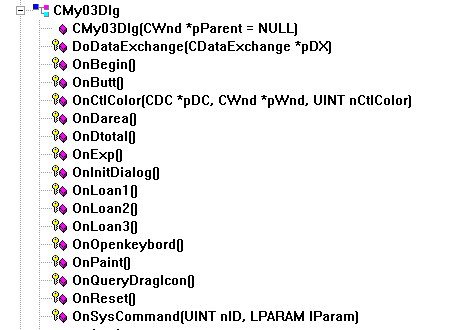

图2 CMy03Dlg类的成员函数列表

CBtnTest类是一个为了实现控制BUTTON按钮属性而添加的类，里面的代码需要根据具体的需要自行添加，这个类是从CButton类继承的类，里面只有有三个成员函数，DrawItem()是为了改变Button按钮而重写的一个函数，SetDownColor()是为了改变按钮按下之后的颜色而写的一个函数，显而易见，SetUpColor()是为了实现改变按钮未按下时的颜色而写的函数。

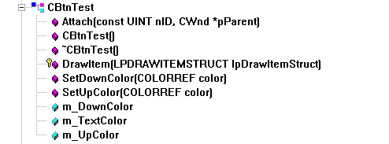

图3 CBtnTest类的成员函数列表

### 2.4 开发环境

Windows操作系统，VC++ 6.0, OFFICE WORD

3 系统详细设计
--------------

### 3.1 设计步骤

打开Microsoft Visual C++ 6.0,在文件中点击新建，在弹出框内选择MFC
AppWizard[exe]工程，输入工程名房贷计算器及其所在位置，点击确定，如图4所示。

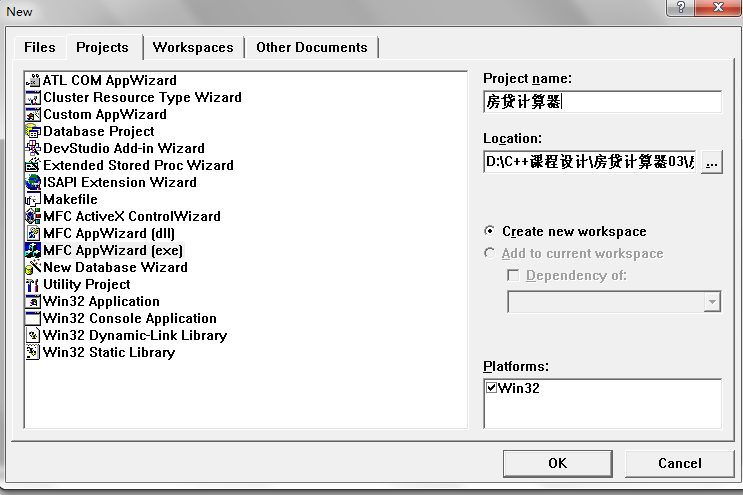

图4新建MFC AppWizard[exe]工程

接下来，选择基本对话框，点击完成，如图5所示。

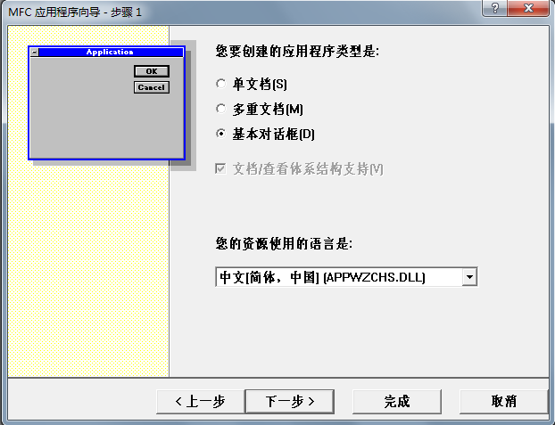

图5 基本对话框

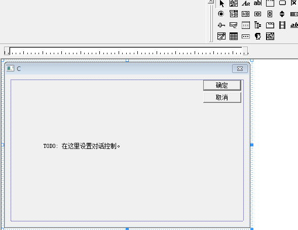

图6 新建对话框

### 3.2 界面设计

界面设计主要是创建控件，在选项卡中打开Dialog资源组，双击IDD_MY03_DIALOG，在右边的窗口中显示出待编辑的对话框。开始摆放控件，包括编辑框和按钮的创建。

1）在
“编辑框”按钮上单击鼠标左键，在对话框编辑窗口上合适的位置按下鼠标左键并拖动鼠标画出一个大小合适的编辑框。在编辑框上单击鼠标右键，在弹出的快捷菜单中选择属性选项，此时弹出Edit属性对话框，如图7所示，在该对话框中输入ID属性。

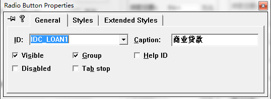

图7 Edit属性对话框

2）在
“Button”按钮上单击鼠标左键，在对话框上的合适的位置上按下鼠标左键并拖动鼠标画出一个大小合适的下压式按钮。在按钮上单击鼠标右键，在弹出的快捷菜单中选择属性选项，如图8所示，在该对话框中输入控件的ID值和标题属性。

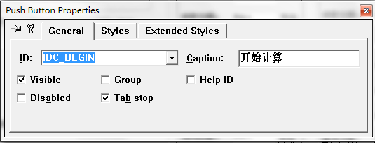

图8 开始计算按钮的属性设置

表1 各按钮和编辑框等对象的属性

| 对象       | ID              | 对应的变量名称 | 标题或说明         |
|------------|-----------------|----------------|--------------------|
| 单选框     | IDC_LOAN1       | m_nLoan1       | 商业贷款           |
| 单选框     | IDC_LOAN2       |                | 公积金贷款         |
| 单选框     | IDC_LOAN3       |                | 组合贷款           |
| 单选框     | IDC_DAREA       | m_nDarea       | 根据面积、单价计算 |
| 单选框     | IDC_DTOTAL      |                | 根据贷款总额计算   |
| 编辑框     | IDC_UNITP       | m_fDj          | 单价               |
| 编辑框     | IDC_AREA        | m_fArea        | 房屋面积           |
| 下拉列表框 | IDC_CSHU        | m_nCshu        | 按揭成数           |
| 编辑框     | IDC_TOTAL1      | m_fTotal1      | 商业贷款总额       |
| 编辑框     | IDC_TOTAL2      | m_fTotal2      | 公积金贷款总额     |
| 下拉列表框 | IDC_YEARS       | m_nYears       | 按揭年数           |
| 编辑框     | IDC_LILV1       | m_fLilv1       | 商业贷款利率       |
| 编辑框     | IDC_LILV2       | m_fLilv2       | 公积金贷款利率     |
| 复选框     | IDC_METH1       | m_nMeth1       | 等额本息还款       |
| 复选框     | IDC_METH2       | m_nMeth2       | 等额本金还款       |
| 按钮       | IDC_BEGIN       | m_begin        | 开始计算           |
| 按钮       | IDC_RESET       | m_reset        | 全部清零           |
| 按钮       | IDC_OPENKEYBORD | m_open         | 打开屏幕键盘       |
| 按钮       | IDC_EXP         | m_exp          | 程序说明           |
| 按钮       | IDOK            | m_TestBtn      | 退出程序           |
| 按钮       | IDC_BUTT        | m_butt         | 隐藏结果           |
| 编辑框     | IDC_REFK1       | m_fFkze1       | 房款总额输出框     |
| 编辑框     | IDC_REDK1       | m_fDkze1       | 贷款总额输出框     |
| 编辑框     | IDC_REHK1       | m_fHkze1       | 还款总额输出框     |
| 编辑框     | IDC_REZF1       | m_fZflx1       | 支付利息输出框     |
| 编辑框     | IDC_RESQ1       | m_fSqfk1       | 首期付款输出框     |
| 编辑框     | IDC_REDKY1      | m_nDkys1       | 贷款月数输出框     |
| 编辑框     | IDC_REYJ1       | m_fYjhk1       | 月均还款输出框     |
| 编辑框     | IDC_REFK2       | m_fFkze2       | 房款总额输出框     |
| 编辑框     | IDC_REDK2       | m_fDkze2       | 贷款总额输出框     |
| 编辑框     | IDC_REHK2       | m_fHkze2       | 还款总额输出框     |
| 编辑框     | IDC_REZF2       | m_fZflx2       | 支付利息输出框     |
| 编辑框     | IDC_RESQ2       | m_fSqfk2       | 首期付款输出框     |
| 编辑框     | IDC_REDKY2      | m_nDkys2       | 贷款月数输出框     |
| 编辑框     | IDC_REYJ2       | m_fYjhk2       | 月均还款输出框     |
| 编辑框     | IDC_REDJ        | m_nMydj        | 每月递减输出框     |

其余文字均为静态文本框，此处不一一列举了。

完成后界面如图9所示。

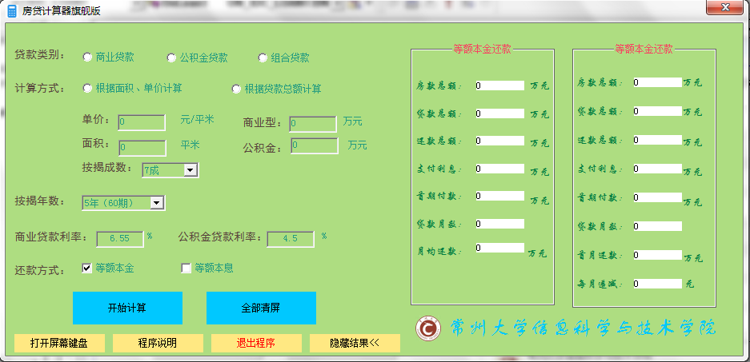

图9 计算器界面

3）连接变量和代码

给编辑框连接变量。在编辑框上单击鼠标右键，在弹出菜单中选择ClassWizard菜单项，弹出MFC
ClassWizard对话框，选择Member Variables选项卡，如图10所示。

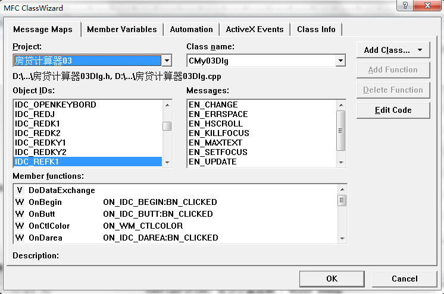

图10 ClassWizard对话框

4）在Control IDs列表框中选择IDC_LOAN1，单击Add
Variables按钮，在弹出的对话框中连接变量m_nLoan1。变量类型设定为int型。如图11所示。

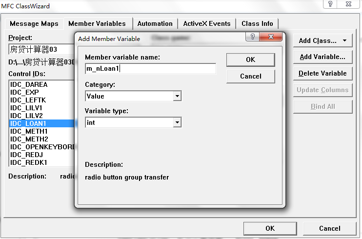

图11 m_nLoan1属性设置

5）在“开始计算”按钮上单击鼠标右键，在弹出的对话框中选择Messages
Maps选项卡，然后在Object
IDs列表框中选择IDC_BEGIN，在Messages列表框中选择BN_CLICKED项，即选择单击按钮事件，如图12所示。

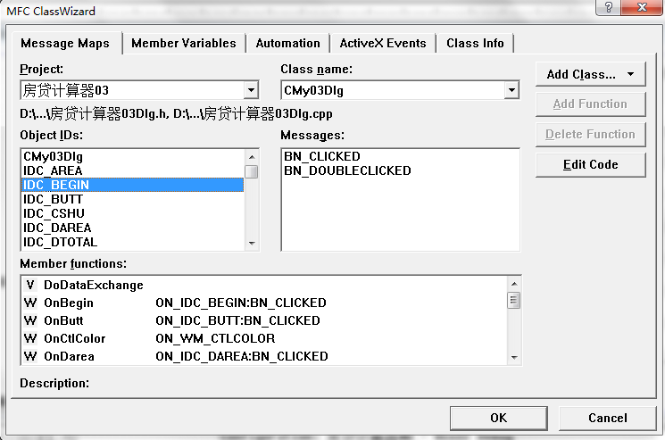

图12 “开始计算”按钮链接代码对话框

最终的得到的界面如图13

图13计算器完整界面

4结论与心得体会
---------------

其实，临近期末事情比较多，所以也是这几天才开始研究MFC编程，所以对MFC这个类库还不是很了解，课程设计第一天的时候基本上不知道该做什么，所以我就从网上下载了一套C++的学习视频，有针对性的选择了几集看了一下，这才开始上手，逐步的摸索才写出来这个计算器。感觉写得并不是很好，因为还有一些问题没有得到完全的解决，比如小键盘的那个问题，至今还没找到解决的方法，只能以后有空再好好想想了！

本来还想上网学一下添加数据库的技术，把这个计算器做成一个可以从网上获取最新的利率信息的程序，但时间不允许了，因为这周就要交上去了！这个学期没有好好学习C++，感觉愧对朱老师这位负责任的好老师！等到放假之后，没有那么多繁琐的事情了，可以好好弄一下C++了，真的要好好学习C++了。

总的来说，这次的课程设计，还是让自己学到不少东西，同时也感觉到自己现在的不足——基础不够扎实，很多东西都是一知半解，真的要好好加强对基础知识的学习了！很多问题，不仅仅只是把功能实现就行了，还要注意代码的优化，把结果做得更好！

5 附录
------

### 5,1 程序主要代码

1.  计算器主要计算代码

void CMy03Dlg::OnBegin()

{

UpdateData(TRUE);

int cs,ys;//分别代表成数和月数，请自己加上Switch语句为其赋值！

switch(m_nLoan1)

{

case 0: //商业贷款计算

switch(m_nDarea)

{

case 0: //根据面积计算

{

m_fTotal1=m_fArea\*m_fDj/10000;

if(m_bMeth1)

{

m_fDkze1=m_fTotal1\*cs/10;

m_fSqfk1=m_fTotal1-m_fDkze1;

}

else

m_fDkze1=m_fSqfk1=0.0f;

if(m_bMeth2)

{

m_fDkze2=m_fTotal1\*cs/10;

m_fSqfk2=m_fTotal1-m_fDkze1;

}

else

m_fDkze2=m_fSqfk2=0.0f;

break;

}

case 1: //根据贷款总额计算

m_fArea=m_fDj=0;

if(m_bMeth1)

{

m_fDkze1=m_fTotal1;

m_fSqfk1=0;

}

else

m_fDkze1=m_fSqfk1=0.0f;

if(m_bMeth2)

{

m_fDkze2=m_fTotal1;

m_fSqfk2=0;

}

else

m_fDkze2=m_fSqfk2=0.0f;

break;

}

if(m_bMeth1) //等额本息计算

{
m_fYjhk1=(m_fDkze1\*m_fLilv1/1200\*pow(1+m_fLilv1/1200,ys))/(pow(1+m_fLilv1/1200,ys)-1);
//计算月均还款1

m_fHkze1=m_fYjhk1\*ys; //计算还款总额1

m_fZflx1=m_fHkze1-m_fDkze1; //计算支付利息1

m_nDkys1=ys;

m_fFkze1=m_fTotal1;

}

else

{

m_fYjhk1=m_fHkze1=m_fZflx1=m_fFkze1=0.0f;

m_nDkys1=0;

}

if(m_bMeth2) //等额本金计算

{

m_fYjhk2=m_fDkze2/ys+(m_fDkze2-0)\*m_fLilv1/1200; //首月付款

m_fMydj=(m_fYjhk2-(m_fDkze2/ys+(m_fDkze2-m_fYjhk2)\*m_fLilv1/12/100))\*10000;
//每月递减

m_fZflx2=m_fDkze2\*m_fLilv1/1200\*(ys+1)/2; //支付利息2

m_fHkze2=m_fDkze2+m_fZflx2; //计算还款总额2

m_nDkys2=ys;

m_fFkze2=m_fTotal1; //计算房款总额

}

else

{

m_fYjhk2=m_fHkze2=m_fZflx2=m_fFkze2=m_fMydj=0.0f;

m_nDkys2=0;

}

break;

case 1: //公积金贷款计算

switch(m_nDarea)

{

case 0:

m_fTotal2=m_fArea\*m_fDj/10000;

if(m_bMeth1)

{

m_fDkze1=m_fTotal2\*cs/10;

m_fSqfk1=m_fTotal2-m_fDkze1;

}

else

m_fDkze1=m_fSqfk1=0.0f;

if(m_bMeth2)

{

m_fDkze2=m_fTotal2\*cs/10;

m_fSqfk2=m_fTotal2-m_fDkze1;

}

else

m_fDkze2=m_fSqfk2=0.0f;

break;

case 1:

m_fArea=m_fDj=0;

if(m_bMeth1)

{

m_fDkze1=m_fTotal2;

m_fSqfk1=0;

}

else

m_fDkze1=m_fSqfk1=0.0f;

if(m_bMeth2)

{

m_fDkze2=m_fTotal2;

m_fSqfk2=0;

}

else

m_fDkze2=m_fSqfk2=0.0f;

break;

}

if(m_bMeth1)

{
m_fYjhk1=(m_fDkze1\*m_fLilv2/100/12\*pow(1+m_fLilv2/100/12,ys))/(pow(1+m_fLilv2/100/12,ys)-1);

m_fHkze1=m_fYjhk1\*ys;

m_fZflx1=m_fHkze1-m_fDkze1;

m_nDkys1=ys;

m_fFkze1=m_fTotal2;

}

else

{

m_fYjhk1=m_fHkze1=m_fZflx1=m_fFkze1=0.0f;

m_nDkys1=0;

}

if(m_bMeth2)

{

m_nDkys2=ys;

m_fFkze2=m_fTotal2;

m_fYjhk2=m_fDkze2/ys+(m_fDkze2-0)\*m_fLilv2/12/100;

m_fMydj=(m_fYjhk2-(m_fDkze2/ys+(m_fDkze2-m_fYjhk2)\*m_fLilv2/12/100))\*10000;

m_fZflx2=m_fDkze2\*m_fLilv2/1200\*(ys+1)/2; //计算还款总额2

m_fHkze2=m_fDkze2+m_fZflx2; //支付利息2

}

else

{

m_fYjhk2=m_fHkze2=m_fZflx2=m_fFkze2=m_fMydj=0.0f;

m_nDkys2=0;

}

break;

case 2: //组合型贷款计算

//组合型贷款等额本息还款

if(m_bMeth1)

{

m_fDkze1=m_fTotal1+m_fTotal2; //贷款总额计算

m_fSqfk1=0; //组合贷款首付0

m_fFkze1=m_fDkze1; //房款总额

m_nDkys1=ys;

m_fYjhk1=(m_fTotal1\*m_fLilv1/100/12\*pow(1+m_fLilv1/100/12,ys))/(pow(1+m_fLilv1/100/12,ys)-1)+(m_fTotal2\*m_fLilv2/100/12\*pow(1+m_fLilv2/100/12,ys))/(pow(1+m_fLilv2/100/12,ys)-1);

m_fHkze1=m_fYjhk1\*ys;

m_fZflx1=m_fHkze1-m_fDkze1;

}

else

{

m_fSqfk1=m_fFkze1=m_fDkze1=m_fYjhk1=m_fHkze1=m_fZflx1=m_fTotal1=m_fTotal2=0.0f;

m_nDkys1=0;

}

//等额本金还款

if(m_bMeth2)

{

m_fDkze2=m_fTotal1+m_fTotal2; //贷款总额计算

m_fSqfk2=0; //组合贷款首付0

m_fFkze2=m_fDkze2; //房款总额

m_nDkys2=ys; //月数

m_fYjhk2=m_fTotal1/ys+(m_fTotal1-0)\*m_fLilv1/12/100+m_fTotal2/ys+(m_fTotal2-0)\*m_fLilv2/12/100;
//首月付款

m_fMydj=(m_fYjhk2-(m_fTotal1/ys+(m_fTotal1-(m_fTotal1/ys+(m_fTotal1-0)\*m_fLilv1/12/100))\*m_fLilv1/12/100)-(m_fTotal2/ys+(m_fTotal2-(m_fTotal2/ys+(m_fTotal2-0)\*m_fLilv2/12/100))\*m_fLilv2/12/100))\*10000;
//每月递减

m_fZflx2=m_fTotal2\*m_fLilv2/1200\*(ys+1)/2+m_fTotal1\*m_fLilv1/1200\*(ys+1)/2;

m_fHkze2=m_fDkze2+m_fZflx2;

}

else

{

m_fSqfk2=m_fFkze2=m_fDkze2=m_fYjhk2=m_fHkze2=m_fZflx2=m_fMydj=m_fTotal1=m_fTotal2=0.0f;

m_nDkys2=0;

}

break;

default:

return;

}

UpdateData(FALSE);

}

1.  隐藏计算结果的代码

void CMy03Dlg::OnButt() //计算器隐藏计算结果

{

CString str;

if(GetDlgItemText(IDC_BUTT,str),str=="隐藏结果\<\<")

{

SetDlgItemText(IDC_BUTT,"显示结果\>\>");

}

else

{

SetDlgItemText(IDC_BUTT,"隐藏结果\<\<");

}

static CRect rectLarge;

static CRect rectSmall;

if(rectLarge.IsRectNull())

{

CRect rectSeparator;

GetWindowRect(\&rectLarge);

GetDlgItem(IDC_STA)-\>GetWindowRect(\&rectSeparator);

rectSmall.left=rectLarge.left;

rectSmall.top=rectLarge.top;

rectSmall.right=rectSeparator.right;

rectSmall.bottom=rectLarge.bottom;

}

if(str=="隐藏结果\<\<")

{

SetWindowPos(NULL,0,0,rectSmall.Width(),rectSmall.Height(),SWP_NOMOVE\|SWP_NOZORDER);

}

else

{

SetWindowPos(NULL,0,0,rectLarge.Width(),rectLarge.Height(),SWP_NOMOVE\|SWP_NOZORDER);

}

}

1.  控制对话框是否可操作的代码

以下为选择商业贷款选项时对其他对话框的操作代码：

void CMy03Dlg::OnLoan1() //选择商业贷款时禁用不需要的对话框

{

GetDlgItem(IDC_TOTAL2)-\>EnableWindow(FALSE);

GetDlgItem(IDC_TOTAL1)-\>EnableWindow(TRUE);

GetDlgItem(IDC_LILV1)-\>EnableWindow(TRUE);

GetDlgItem(IDC_LILV2)-\>EnableWindow(FALSE);

GetDlgItem(IDC_DAREA)-\>EnableWindow(TRUE);

GetDlgItem(IDC_DTOTAL)-\>EnableWindow(TRUE);

}

1.  显示程序说明弹窗的代码

void CMy03Dlg::OnExp() //显示弹窗

{

PlaySound("230.wav",NULL,SND_ALIAS\|SND_ASYNC);

CAboutDlg dlg;

dlg.DoModal();

}

1.  对话框颜色和字体控制的部分代码

HBRUSH CMy03Dlg::OnCtlColor(CDC\* pDC, CWnd\* pWnd, UINT nCtlColor)
//对话框颜色字体控制

{

HBRUSH hbr = CDialog::OnCtlColor(pDC, pWnd, nCtlColor);

if(pWnd-\>GetDlgCtrlID()==IDC_AREA)

{

pDC-\>SetTextColor(RGB(38,157,128));

pDC-\>SetBkColor(RGB(174,221,129));

}

if(pWnd-\>GetDlgCtrlID()==IDC_RESET)

{

m_reset.SetDownColor(RGB(224,160,158));

m_reset.SetUpColor(RGB(0,200,255));

pDC-\>SetTextColor(RGB(0,0,0));

}

if(pWnd-\>GetDlgCtrlID()==IDC_BUTT)

{

m_butt.SetDownColor(RGB(224,160,158));

m_butt.SetUpColor(RGB(255,232,130));

pDC-\>SetTextColor(RGB(0,0,0));

}

return m_brush;

}

1.  打开系统屏幕键盘代码

void CMy03Dlg::OnOpenkeybord()

{

ShellExecute(NULL, \_T("open"), \_T("osk.exe"), NULL, NULL, SW_SHOW);

}

1.  CBUTTON类方法的重写以改变BUTTON的前景色、字体颜色等属性

CBtnTest::CBtnTest(void)

{

m_DownColor = m_UpColor = RGB(0,0,0);//初始化设为黑色

}

CBtnTest::\~CBtnTest(void){}

BEGIN_MESSAGE_MAP(CBtnTest, CButton)

END_MESSAGE_MAP()

BOOL CBtnTest::Attach(const UINT nID,CWnd\* pParent)

{

if (!SubclassDlgItem(nID, pParent))

return FALSE;

return TRUE;

}

void CBtnTest::SetDownColor(COLORREF color)

{

//CMyButton类的函数

m_DownColor = color;

}

void CBtnTest::SetUpColor(COLORREF color)

{

m_UpColor = color;

}

void CBtnTest::DrawItem(LPDRAWITEMSTRUCT lpDrawItemStruct)

{

CDC dc;

dc.Attach(lpDrawItemStruct-\>hDC);//得到绘制的设备环境CDC

VERIFY(lpDrawItemStruct-\>CtlType==ODT_BUTTON);

//得当Button上文字,这里的步骤是:1,先得到在资源里编辑的按钮的文字,

//然后将此文字重新绘制到按钮上,

//同时将此文字的背景色设为透明,这样,按钮上仅会显示文字

const int bufSize = 512;

TCHAR buffer[bufSize];

GetWindowText(buffer, bufSize);

int size=strlen(buffer);//得到长度

DrawText(lpDrawItemStruct-\>hDC,buffer,size,\&lpDrawItemStruct-\>rcItem,DT_CENTER\|DT_VCENTER\|DT_SINGLELINE\|DT_TABSTOP);//绘制文字

SetBkMode(lpDrawItemStruct-\>hDC,TRANSPARENT);//透明

if (lpDrawItemStruct-\>itemState&ODS_SELECTED)//当按下按钮时的处理

{////重绘整个控制

CBrush brush(m_DownColor);

dc.FillRect(\&(lpDrawItemStruct-\>rcItem),&brush);//利用画刷brush，填充矩形框

//因为这里进行了重绘,所以文字也要重绘

DrawText(lpDrawItemStruct-\>hDC,buffer,size,\&lpDrawItemStruct-\>rcItem,DT_CENTER\|DT_VCENTER\|DT_SINGLELINE\|DT_TABSTOP);

SetBkMode(lpDrawItemStruct-\>hDC,TRANSPARENT);

}

else//当按钮不操作或者弹起时

{

CBrush brush(m_UpColor);

dc.FillRect(\&(lpDrawItemStruct-\>rcItem),&brush);//

DrawText(lpDrawItemStruct-\>hDC,buffer,size,\&lpDrawItemStruct-\>rcItem,DT_CENTER\|DT_VCENTER\|DT_SINGLELINE\|DT_TABSTOP);

SetBkMode(lpDrawItemStruct-\>hDC,TRANSPARENT);

}

if ((lpDrawItemStruct-\>itemState&ODS_SELECTED)&&(lpDrawItemStruct-\>itemAction
&(ODA_SELECT\|ODA_DRAWENTIRE)))

{//选中了本控件,高亮边框

COLORREF
fc=RGB(255-GetRValue(m_UpColor),255-GetGValue(m_UpColor),255-GetBValue(m_UpColor));

CBrush brush(fc);

dc.FrameRect(\&(lpDrawItemStruct-\>rcItem),&brush);//用画刷brush，填充矩形边框

}

if (!(lpDrawItemStruct-\>itemState &ODS_SELECTED)
&&(lpDrawItemStruct-\>itemAction & ODA_SELECT))

{

CBrush brush(m_UpColor); //控制的选中状态结束,去掉边框

dc.FrameRect(\&lpDrawItemStruct-\>rcItem,&brush);//

}

dc.Detach();

}
